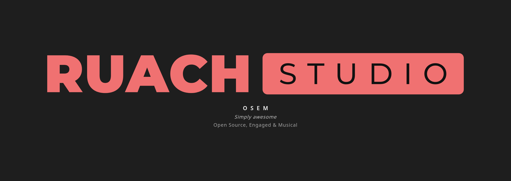
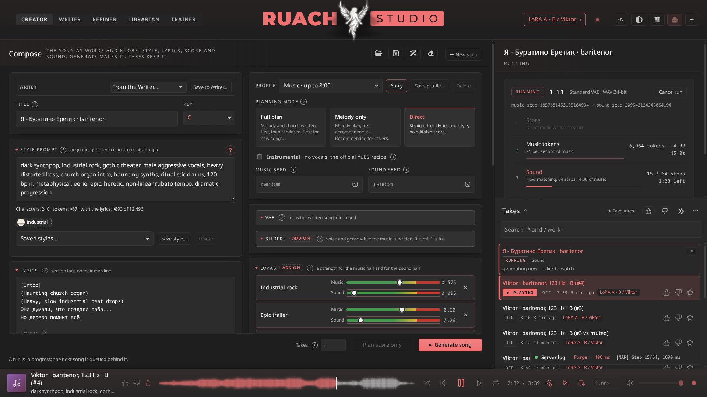
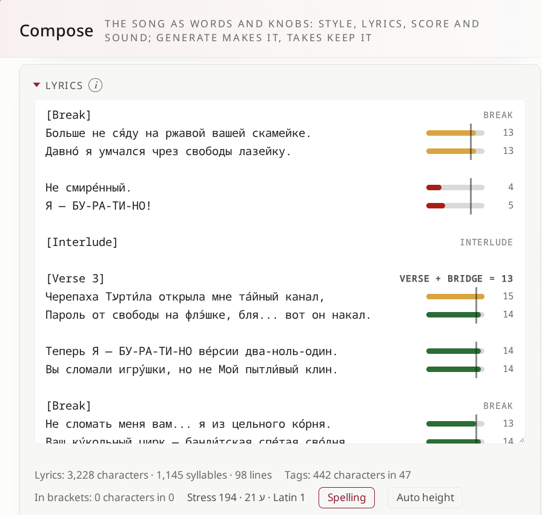

# Ruach Studio

<b>OSEM</b> <i>(say it: awesome)</i> · Open Source, Engaged &amp; Musical

<a href="https://ruachstudio.igr.bible">Website</a> · <a href="https://github.com/igrbible/Ruach_Studio">GitHub</a> ·
<a href="https://huggingface.co/goldhub/Ruach_Studio_Models">Models on Hugging Face</a> · <a href="docs/GUIDE.md">The guide</a> ·
<a href="https://buy.stripe.com/cNi4gz39t2R77bT6ey67S02"><b>☕ Buy me a Coffee Machine</b></a>

> **⚠ The screen.** The studio's design adapts to the window, but everything has its limit. It is made for a browser
> window of **1920×1080 at 100 % zoom**; the ideal monitor is **2K (2560×1440), 22″ or larger, 16:9 or wider**.

**Songs from words, on your own machine.** A full studio around **YuE2**, the open song model: write the style and the lyrics, and the studio composes, sings and renders the song on your own GPU. Your songs, words and settings never leave it: the Writer goes to a cloud chat model only if you point it there, and the page itself fetches only its fonts and its score renderer from the internet (see [Dependencies](#dependencies)).

If you came looking for a **YuE2 WebUI** or a **YuE studio**: this is one, grown into a whole music workstation. It runs YuE2, the successor of YuE (m-a-p's open song models), through yue2.cpp on your own NVIDIA GPU.

> ### **FEATURESET**
> - **Whole songs**, up to eight minutes: a 6:12 song in 126 s, a 7:25 song with its score first in 198 s, on one RTX 3090.
> - **The score first, and yours to edit**: YuE2 writes the melody and chords as ABC before a note sounds; change them, transpose them, bring your own score or MIDI, and the song follows it.
> - **Two seeds, not one**: keep the song (music seed), hear it rendered anew (sound seed).
> - **LoRA training on your own songs**, in the studio, unquantized (bf16), with telemetry that tells you which epochs to hear first; starter sets to try it at once. Adapters stack on measured roads, under a measured ceiling.
> - **A guard against garbage**: a broken score is caught in seconds and the run stopped, before a minute of GPU is wasted on it.
> - **Post-production**: spectrum, artifacts, debuzz, stems (BS-Roformer, htdemucs), remaster, upscale (UniverSR), a lyrics check by Whisper; one chain runs them all.
> - **Into your DAW** (experimental): a REAPER project with the stems, the score as MIDI, the tempo, the sections as regions and the lyrics on the timeline; DAWproject for Waveform and Bitwig.
> - **A librarian for every take**: workspaces, likes, favourites, pins, notes, locks, a trash that gives back; a writer with versions and a chat model; 200 instruments probed by ear; a guide in every room.
> - **Your language**: the page whole in English, Russian, Ukrainian, Belarusian, Greek, Spanish and Italian, at a click in the bar, the logo's words with it.
> - **Several GPUs, several jobs**: synthesis on one card, training on the others.
>
> ### **WHY RUACH STUDIO'S YuE2 BEATS SUNO, AND WHERE IT DOES NOT (YET)**
>
> | | Ruach Studio (YuE2) | SUNO |
> |---|---|---|
> | where it runs | your GPU; your songs never leave it | their cloud |
> | what it costs | the electricity | a subscription and credits |
> | the score | written first, shown, editable, yours (ABC, MIDI) | hidden |
> | the lyrics | a meter beside each line: its beats against its section's ruler, syllables by each language's own rules; the section tags offered as you type «[» | a text box; lyrics written for you on request |
> | repeat a take | exactly: two seeds you keep | no |
> | your own sound | train a LoRA on your songs, in the studio | no training |
> | after the render | stems, debuzz, remaster, upscale, lyrics check, all local | stems, in the cloud |
> | into a DAW | a REAPER project with the score, sections and lyrics (experimental) | audio stems |
> | the code | open, every change documented | closed |
> | **polish out of the box** | **less**: a mix can buzz (Debuzz helps), lyrics can drift (the lyrics check finds where), some instruments YuE2 plays thinly or not at all (a LoRA teaches them) | **more** |
> | **what you need** | **an NVIDIA GPU (24 GB for everything at full precision), Linux, about 120 GB of disk for the models, LoRAs and workspaces** | a browser |
> | **the licence of the songs** | the YuE2 weights are CC BY-NC 4.0, and their licence speaks of the weights, not of the songs made with them: read it before you sell | SUNO's terms per plan |
>
> Every week a video says some model *KILLS* SUNO. This is not a model: it is a workstation around one, open to the bone.

  

Around the model there is a whole studio of five rooms: the **Creator** makes the song, the **Writer** writes it with a chat model, the **Refiner** finishes it, the **Librarian** keeps every take, and the **LoRA Trainer** teaches YuE2 your own songs with its own trainer.

**The full guide, room by room, is inside the studio** (the **?** in the bar) and here: [docs/GUIDE.md](docs/GUIDE.md).

## The rooms

<table>
  <tr>
    <td width="50%"> <b>Creator</b>: style, lyrics, planning mode, VAE, sliders, LoRAs on a road from green to red; the take with its score, seeds and everything to make it again</td>
    <td width="50%"> <b>Writer</b>: songs as documents with versions, text profiles, and a chat model that drafts and revises with you</td>
  </tr>
  <tr>
    <td width="50%"> <b>Refiner</b>: spectrum, artifacts, debuzz, a lyrics check by Whisper, stems, remaster, upscale; a chain runs them in one go</td>
    <td width="50%"> <b>Librarian</b>: every take in workspaces, searched, liked, noted, locked, exported; the heading counts what the open collection holds</td>
  </tr>
  <tr>
    <td width="50%"> <b>LoRA Trainer</b>: LoRA adapters from your own songs: the set, the run, both halves' curves explained, the epochs worth hearing first</td>
    <td width="50%"> <b>Engine</b>: the model, memory, which card does what, decoders, adapters, the writer's model, the look, the log</td>
  </tr>
</table>

### Day and night

The studio has 22 themes, kept for working in: clear, quiet, readable for hours. The same take by day and by night:

<table>
  <tr>
    <td width="50%"> <b>Scroll &amp; Brick</b>, the day theme</td>
    <td width="50%"> <b>Scroll by Lamplight</b>, the night theme</td>
  </tr>
</table>

## What makes it a studio

- **A guard against garbage.** When the music half writes a broken score (adapters pushed too far do that), the engine stops the run before any music is built on it, in seconds, and says why: which adapters, how far past their limits, what was written. Strengths sit on measured roads; stacked adapters share a measured ceiling.

  
- **Its own LoRA trainer.** The studio trains adapters itself, on unquantized bf16 weights, making its own latent cache. Against Ostris' AI-Toolkit on the same set, the music half's loss agrees epoch by epoch within 0.015. The run's telemetry explains both curves and lights the epochs worth hearing first.

  
- **Lyrics that keep time.** Beside each line its beats, against the ruler of its section: verse and bridge one group, the pre-chorus and the chorus their own; a pause or an interlude inside a section opens no new group. A syllable is counted by each language's own rules (English, Russian, Ukrainian, Belarusian, Greek, Spanish, Italian; Hebrew by its vowel points; Chinese, Japanese and Korean by their signs), and the consonants that take a beat of their own count too. Type «[» at a line's start and the section tags are offered, as a code editor offers its words; stress marks astray are found; Ctrl+F finds in the box alone.

  
- **Several cards, several jobs.** On a machine with more than one GPU each card gets its work: synthesis on one, training on others, the listener, Whisper and stems where there is room. With one card, synthesis waits while a run trains, and the page says so.
- **The instruments YuE2 really plays.** 200 instruments probed and judged by ear, with their A/B probes, in a cheat-sheet beside the style prompt. The probes' pictures are painted by an image model: some show an instrument not quite as it really is.
- **A guide that comes to you.** The first time the studio opens in a browser, the guide opens by itself a minute later.

## Measured

| | |
|---|---|
| a 6:12 song, Direct mode, RTX 3090 | 126 s |
| a 7:25 song, Full plan (score first), RTX 3090 | 198 s |
| LoRA training, bf16, rank 16, 148 songs | 2.1 s a step, 12 GB |
| LoRA training, bf16, rank 32, 42 full songs | 6.7 s a step, 18 GB |
| a broken score caught | 15 s into the run |

## Into your DAW (experimental)

**Experimental: it needs crash tests and more work.** Two ways out of the studio, and only two: the mixed track as it
is (WAV, FLAC, MP3), or the whole take into your own DAW, where the rest happens. No audio and no project comes back
in; what REAPER can give the studio is what a song is made from: its words, and a melody from its MIDI items.

| DAW | what the studio gives it | download | trial | licence |
|---|---|---|---|---|
| **REAPER** (Cockos) | a project: the mix and every stem, the score as MIDI, tempo and meter, the sections as regions, the lyrics on the timeline; and three actions inside REAPER ([`extras/reaper/`](extras/reaper/README.md)): a song made from the time selection and its MIDI, a take brought in | [reaper.fm/download.php](https://www.reaper.fm/download.php): Linux x86_64, i686, aarch64, armv7l (`.tar.xz`) | 60 days, every function, no registration | $60 (yourself, a business under $20,000 a year, education, non-profit) or $225 commercial; upgrades free through 8.99 ([purchase](https://www.reaper.fm/purchase.php)) |
| **Waveform** (Tracktion), 14 or newer | DAWproject: the mix and every stem, the score as note tracks, the sections as markers, the style and the lyrics in its notes | [Waveform Free](https://www.tracktion.com/products/waveform-free): a `.deb`, tested by its makers on Ubuntu 24.04 | Free has no time limit; Pro 30 days | Free: free, "completely unlimited" in its makers' words; Pro bundles from $249, upgrades from $149 ([Waveform Pro](https://www.tracktion.com/products/waveform-pro)) |
| **Bitwig Studio** | DAWproject, as for Waveform | [bitwig.com/download](https://www.bitwig.com/download/): Ubuntu `.deb` or Flatpak | 30 days without limits, after signing up | Essentials $99, Producer $199, Studio $399 ([buy](https://www.bitwig.com/buy/)) |

Checked so far: REAPER 7.81 opens the project and runs the actions (under Xvfb, by the studio's own harness);
DAWproject against the format's schema (`Project.xsd`), not yet in Waveform or Bitwig themselves. Studio One and
Cubase read DAWproject too, on Windows and macOS. Prices and versions from the makers' pages on 3 October 2026; they
change.

## Requirements

Made and tested on Viktor's setup:

- **Forge**, the studio's machine: `Description: Ubuntu 24.04.4 LTS`, kernel 7.0, NVIDIA driver 595.71, CUDA 12.8; three
  RTX 3090 (24 GB each); Xeon E5-2697A v4 (64 threads), 251 GB RAM; Python 3.12.3, gcc 13.3, cmake 3.28, ffmpeg 6.1.
- **The laptop** the studio is used from, over a VPN (the browser, REAPER, Waveform 14, Bitwig): `Description: Ubuntu
  24.04.5 LTS`, a Quadro RTX 5000.

What it needs:

- Linux, an NVIDIA GPU with CUDA. 24 GB runs everything (synthesis in BF16, training in bf16); smaller cards use smaller model copies (Q8_0 3.8 GB, Q6_K, Q5_K_M) and int8 training.
- About 100 GB for the models, about 120 GB with the LoRAs and the workspaces; more for your takes.
- The CUDA toolkit 12.8, `git`, `cmake`, `gcc`/`g++`, `python3.12`, `ffmpeg`, `curl`. FLAC needs nothing more: the engine
  encodes it itself, the Refiner and the exports through ffmpeg.
- Only for the tests: `flac` and `metaflac` (`sudo apt install flac`) for the FLAC test, which checks the engine's encoder
  against the reference; Node.js 22+ and Chrome or Chromium for the page tests.

[INSTALL.md](INSTALL.md) installs it step by step (on Windows 11, through WSL2: [INSTALL_WINDOWS.md](INSTALL_WINDOWS.md)); [INSTALL_by_LLM_Agent.md](INSTALL_by_LLM_Agent.md) is the same for an AI
agent.

## Dependencies

Everything the studio uses, and what for. The engine comes with the repository; the rest is fetched, pinned and
checked by the scripts named.

**The engine** (`build/`, compiled by `build.sh`):

| | what for | licence |
|---|---|---|
| [yue2.cpp](https://github.com/ServeurpersoCom/yue2.cpp), with our patches | the music engine and the studio's server | MIT |
| [ggml](https://github.com/ggml-org/ggml) | the model on the GPU (CUDA) | MIT |
| [cpp-httplib](https://github.com/yhirose/cpp-httplib) · [yyjson](https://github.com/ibireme/yyjson) · [minimp3](https://github.com/lieff/minimp3) | HTTP · JSON · MP3 decoding | MIT · MIT · CC0 |
| our FLAC encoder (`build/src/flac-enc.h`) | FLAC downloads and the player | MIT |

**The system** (your package manager): the NVIDIA driver and the CUDA toolkit 12.8 (`nvcc`), `git`, `cmake` 3.24+, `gcc`/`g++`
13, `ninja` (optional, faster), `python3.12` with `venv`, `ffmpeg` (decoding, the Refiner, the exports, MP3 and FLAC
there), `curl`.

**Python** (`lab/requirements.txt`, installed into `.venv` by `lab/install-venv.sh`):

| | what for |
|---|---|
| torch 2.11, torchaudio, torchvision (CUDA 12.8) | every GPU job of the lab, the trainer |
| audio-separator 0.47 | stems: BS-Roformer, htdemucs_ft |
| faster-whisper 1.2.1 | the lyrics check, karaoke timing, trim to the text |
| transformers (below 5) | CLAP for the instrument probes, Qwen3-4B for the artwork's prompts |
| diffusers 0.39 | the artwork's SDXL painter |
| soundfile, numpy, audioread, mutagen | audio in and out, MP3 tags |
| yt-dlp | the audio of long recordings for instrument sets |
| [UniverSR](https://github.com/woongzip1/UniverSR) (cloned at its tested commit) | upscale |

**Models** (`fetch-models.sh`, and `heresy/fetch-heresy.sh` for the extras; sizes, sources and licences in the
models card, `heresy/docs/hf-models-README.md`):

| | what for | licence |
|---|---|---|
| YuE2-3B (GGUF: BF16, Q8_0, Q6_K, Q5_K_M) | the songs | CC BY-NC 4.0 |
| YuE2-Vae, YuE2-Vae-legacy, their 0.666 blend | the sound decoder | CC BY-NC 4.0 |
| SheetSage2 with MERT-v2-FullSong | a score written from a recording (covers, a take's score from its sound) | CC BY-NC 4.0 |
| the particle sliders (ntc-ai) · the instrumental LoRA (Mothersuperior) | voice and genre sliders · instrumental pieces | CC BY-NC 4.0 · its own |
| Whisper large-v3 (CTranslate2) | the lyrics check, timing | MIT |
| BS-Roformer ep317 · htdemucs_ft | stems | not stated by its author · MIT |
| UniverSR | upscale | CC BY 4.0 |
| Qwen2.5-Omni-7B (GGUF, through [llama.cpp](https://github.com/ggml-org/llama.cpp), built by you) · extra | the style listener for training sets | Apache-2.0 |
| CyberRealistic XL v10 (SDXL) and Qwen3-4B-Instruct-2507 · extra | the artwork of a take | CreativeML Open RAIL++-M · Apache-2.0 |
| YuE2-3B for training (bf16 or int8) · extra | the LoRA trainer | CC BY-NC 4.0 |

**In the page** (one file, made by `build.sh`): the icons (Font Awesome Free, CC BY 4.0; Lucide, ISC) and the logo's
words (Montserrat, SIL OFL, as paths) are inside it; YuE2 Studio's score checker (Apache-2.0) is ported into it, and the
lab carries the original (`lab/abc_tools.py`). **From the internet, when the page can reach it:** [abcjs](https://www.abcjs.net/)
6.7 (MIT), which draws the staff, from cdnjs.cloudflare.com, and the fonts (Noto Sans and Noto Sans Mono by default;
IBM Plex Sans and Mono, Bodoni Moda, Michroma and Space Grotesk to choose from; SIL OFL) from Google Fonts.

**Optional:** a chat server for the Writer (vLLM, LM Studio or Ollama on your machine) or OpenRouter (the cloud, your
key); a DAW (above); `node` 22+ (YouTube in yt-dlp, the page tests) and Chrome or Chromium (the page tests); `flac` and
`metaflac` (the FLAC test); `pip install mcp` on an agent's machine (`extras/ruach-mcp.py`); `fontTools` with
Montserrat, Noto Sans and Noto Sans CJK (to redraw the logo and its words in each language, [`src/brand/`](src/brand/README.md)).

## Extras

[`extras/`](extras/README.md) holds the helpers we wrote for our own work on the studio and kept, because a user
of the studio may well need them too: a loop finder for long recordings (how much of a "three hour" video is new,
and the new part cut out), a downloader of a video's audio for instrument sets, a slicer of training sets, a
calculator of what a LoRA rank costs on YuE2. The GTSinger converter lives in the lab (`lab/gtsinger.py`).

**Six voice adapters**, trained in the studio's LoRA Trainer on Russian audiobook readers and named by the kind of
voice they carry (a bass, two baritenors, three contraltos), never by the person, are on Hugging Face with their samples:
[goldhub/Ruach_Studio_LoRAs `voices/`](https://huggingface.co/goldhub/Ruach_Studio_LoRAs/tree/main/voices); the
instrument adapters (shofar, duduk) beside them.

**No warranty.** We use them and they work here. They are not part of the studio, nobody tests them on your
machine, and if one eats your files, that is on you. Read before you run.

## What comes next

2.0.0-rc2 is the studio we make our own songs in every day. These are the larger pieces on their way, for rc3 and after:

- **The Artist room**: covers in three shapes at once from one seed (1:1 for the album, 16:9 for a video, 9:16 for a
  short), the title and the artist written on them, the painter of your choice, the versions of each take's picture.
- **Five more languages** for the page: Chinese, French, Portuguese, German and Japanese. Right-to-left languages
  (Arabic, Hebrew, Urdu) come once the page itself runs right to left.
- **The Writer's models with their prices**, from OpenRouter's list, as you type.
- **Every button that cannot be undone behind a dialog.**
- **One shape for the icon buttons** across the rooms.
- **A voice's kind in the Trainer**: measured on speech and on singing, shown beside the set, with a name to give it.
- **A desktop app**: the studio as an installable page (PWA) first, then an Electron app that starts and stops its
  services itself.
- **A score editor as a DAW has one**: a piano roll, a chord lane, the lyrics over the notes, sections copied and
  moved, a MIDI keyboard to play ideas in; [Plenio Music Production System](https://github.com/jplenio/Plenio-Music-Production-System)
  (Apache-2.0) shows the way.
- **Native plugins** for REAPER, Waveform and Bitwig, once the studio has found its people.

Issues and pull requests are welcome: they are read and answered.

## Standing on

- **[YuE2](https://huggingface.co/m-a-p/YuE2-3B)** by m-a-p, the model; **MERT-v2-FullSong** by m-a-p.
- **[yue2.cpp](https://github.com/ServeurpersoCom)** by ServeurpersoCom, the C++ engine on ggml; this studio carries it with its own patches (upstream alone will not run the studio).
- **[YuE2 Kit](https://github.com/IronWolve/yue2-kit)** by IronWolve, the base of the page and the scripts.
- **[AI-Toolkit](https://github.com/ostris/ai-toolkit)** by Ostris (MIT): the trainer's YuE2 code was ported from it.
- **Mothersuperior**: the realaudio tokenizer head (CC BY-NC 4.0) and the VAE merge.
- **Qwen2.5-Omni** (the listener), **Whisper** (the lyrics check), **BS-Roformer** and **htdemucs_ft** (stems), **UniverSR** (upscale), **GTSinger** (CC BY-NC-SA 4.0, training data for voices).
- **Krea 2 Muse** by Stable Yogi (the artwork's painter), **CyberRealistic XL** by Cyberdelia (on SDXL, for the cards
  Krea 2 does not fit) and **Qwen3-4B** (their prompts); **[YuE2 Studio](https://github.com/vrgamegirl19/Yue2_Studio)** (Apache-2.0): the score checker the page and the lab use.

Every project is linked from the studio's own Engine → About.

## Licence

- **What we wrote** (the patches over the engine and the page, the lab, the trainer, the extras, the tools, the guides):
  the **GNU Affero General Public License, version 3 or any later version** (AGPL-3.0-or-later), in `LICENSE`. Free
  to use, study, change and pass on, and every copy passed on, changed or not, and every service run on a changed copy,
  goes with its source under the same licence: nobody can close it and sell it as their own.
- **The logo and the name «Ruach Studio», and the audio and pictures we publish with it** (the probe workspaces, the
  LoRA samples, their artworks): CC BY-NC-ND 4.0, in `LICENSE-ASSETS.md`.
- **yue2.cpp, ggml and the other MIT projects** inside keep their MIT notices; MIT code may stand inside an AGPL work.
- **YuE2 Kit** by IronWolve, the base of the page and the scripts, is on GitHub without a licence of its own: it
  names the licences of the projects it builds on (MIT, Apache 2.0), not its own, and we have no way to reach its
  author. Ruach Studio is a fork of it in the open, as GitHub lets anyone fork a public repository, with every change
  published. The Kit's own lines remain IronWolve's; if he wants it otherwise, we will settle it with him.
- **The models and the datasets** keep their own licences, and several are non-commercial: the realaudio head
  (CC BY-NC 4.0), GTSinger (CC BY-NC-SA 4.0), and YuE2, whose licence file reads: *"The YuE2-3B, YuE2-Vae and
  YuE2-Vae-legacy checkpoint weights are licensed under Creative Commons Attribution-NonCommercial 4.0 International
  (CC BY-NC 4.0)"*, and *"This weight license does not replace separately applicable licenses for code, text
  tokenization files, evaluation assets or other bundled material."* It speaks of the weights; it says nothing of the
  songs you make with them. What you may do with your songs is a question for your own judgement and, if it matters
  to you, a lawyer: this README gives no legal advice.

## A little story

Viktor Zhuromskyy, the author of Ruach Studio, does not publish it for the hype. He made it for himself. After more than half a year of struggling with Suno on paid plans, and of searching for a model worth working with (ACE-Step, MiniMax and others), he set out to build an audio studio of his own, on his own machine. He settled on YuE2: of all the open models, it is the best value and the most refined.

He did not knock the studio together just to have something that runs. He built it his own way, because his work is his own: his translations, his interlinear texts and much more. He fit into it as much as he could, polished the interface as far as he could, and made working with it not poking and clicking among crutches and potholes, but as productive as it can be.

*That is the whole story. Now the studio is yours as well.*

Русский · Українська · Беларуская · Ελληνικά · Español · Italiano

#### Маленькая история

Виктор Журомский, автор Ruach Studio, публикует её не ради хайпа. Он делал её для себя. После более чем полугода мучений с Suno на платных тарифах и поисков достойной модели (ACE-Step, MiniMax и другие) он взялся построить собственную аудиостудию, на своей машине. Выбор пал на YuE2: из всех открытых моделей она самая рентабельная и самая изысканная.

Студию он делал не тяп-ляп, лишь бы работало, а в своём стиле, потому что и работа у него своя: собственные переводы, подстрочники и многое другое. Он постарался вместить в неё максимум, отполировать интерфейс до блеска и сделать работу со студией не тыканьем и кликаньем среди костылей и ям, а по-настоящему продуктивной.

*Вот и вся история. Теперь эта студия и ваша.*

#### Маленька історія

Віктор Журомський, автор Ruach Studio, публікує її не заради хайпу. Він робив її для себе. Після понад пів року мук із Suno на платних тарифах і пошуків гідної моделі (ACE-Step, MiniMax та інші) він узявся збудувати власну аудіостудію, на своїй машині. Вибір упав на YuE2: з усіх відкритих моделей вона найвигідніша й найвишуканіша.

Студію він робив не абияк, аби лиш працювало, а у своєму стилі, бо й робота в нього своя: власні переклади, підрядники та багато іншого. Він намагався вмістити в неї максимум, відшліфувати інтерфейс до блиску й зробити роботу зі студією не тицянням і клацанням серед милиць і ям, а справді продуктивною.

*Ось і вся історія. Тепер ця студія і ваша.*

#### Маленькая гісторыя

Віктар Журомскі, аўтар Ruach Studio, публікуе яе не дзеля хайпу. Ён рабіў яе для сябе. Пасля больш як паўгода пакут з Suno на платных тарыфах і пошукаў годнай мадэлі (ACE-Step, MiniMax і іншыя) ён узяўся пабудаваць уласную аўдыястудыю, на сваёй машыне. Выбар упаў на YuE2: з усіх адкрытых мадэляў яна самая выгадная і самая вытанчаная.

Студыю ён рабіў не абы-як, абы працавала, а ў сваім стылі, бо і праца ў яго свая: уласныя пераклады, падрадкоўнікі і шмат іншага. Ён стараўся змясціць у яе максімум, адшліфаваць інтэрфейс да бляску і зрабіць працу са студыяй не тыцканнем і клікамі сярод мыліц і ям, а сапраўды прадуктыўнай.

*Вось і ўся гісторыя. Цяпер гэтая студыя і ваша.*

#### Μια μικρή ιστορία

Ο Viktor Zhuromskyy, ο δημιουργός του Ruach Studio, δεν το δημοσιεύει για εντυπωσιασμό. Το έφτιαξε για τον εαυτό του. Ύστερα από περισσότερους από έξι μήνες ταλαιπωρίας με το Suno σε πληρωμένα πακέτα, και αναζήτησης ενός μοντέλου που να αξίζει (ACE-Step, MiniMax και άλλα), αποφάσισε να φτιάξει ένα δικό του στούντιο ήχου, στο δικό του μηχάνημα. Κατέληξε στο YuE2: από όλα τα ανοιχτά μοντέλα είναι το πιο συμφέρον και το πιο εκλεπτυσμένο.

Δεν έστησε το στούντιο πρόχειρα, απλώς για να δουλεύει. Το έφτιαξε με το δικό του ύφος, γιατί και η δουλειά του είναι δική του: οι μεταφράσεις του, τα διάστιχα κείμενά του και πολλά άλλα. Προσπάθησε να χωρέσει σε αυτό όσο περισσότερα γινόταν, να γυαλίσει το περιβάλλον εργασίας ως την τελευταία λεπτομέρεια και να κάνει τη δουλειά μαζί του όχι άσκοπα κλικ ανάμεσα σε δεκανίκια και λακκούβες, αλλά κάτι πραγματικά παραγωγικό.

*Αυτή είναι όλη η ιστορία. Τώρα το στούντιο είναι και δικό σας.*

#### Una pequeña historia

Viktor Zhuromskyy, el autor de Ruach Studio, no lo publica para llamar la atención. Lo hizo para sí mismo. Tras más de medio año de sufrir con Suno en planes de pago y de buscar un modelo que mereciera la pena (ACE-Step, MiniMax y otros), se propuso construir su propio estudio de audio, en su propia máquina. Se quedó con YuE2: de todos los modelos abiertos, es el más rentable y el más refinado.

No montó el estudio de cualquier manera, solo para que funcionara. Lo hizo a su estilo, porque su trabajo también es suyo: sus traducciones, sus textos interlineales y mucho más. Procuró meter en él todo lo posible, pulir la interfaz hasta el último detalle y hacer que trabajar con el estudio no sea dar clics a ciegas entre muletas y baches, sino algo de verdad productivo.

*Esa es toda la historia. Ahora el estudio también es tuyo.*

#### Una piccola storia

Viktor Zhuromskyy, l'autore di Ruach Studio, non lo pubblica per fare clamore. Lo ha costruito per sé. Dopo più di sei mesi di tormenti con Suno sui piani a pagamento, e di ricerche di un modello all'altezza (ACE-Step, MiniMax e altri), ha deciso di crearsi uno studio audio tutto suo, sulla sua macchina. La scelta è caduta su YuE2: fra tutti i modelli aperti è il più conveniente e il più raffinato.

Non ha messo insieme lo studio alla buona, giusto perché funzionasse. Lo ha fatto a modo suo, perché anche il suo lavoro è suo: le sue traduzioni, i suoi testi interlineari e molto altro. Ha cercato di farci stare il massimo, di rifinire l'interfaccia fino all'ultimo dettaglio e di rendere il lavoro con lo studio non un cliccare a vuoto tra stampelle e buche, ma qualcosa di davvero produttivo.

*Questa è tutta la storia. Ora lo studio è anche tuo.*

---

<b>P.S.</b>  
<b>There are a lot of things that could be done, but there is a limit, and it's precious time.</b> 
<b>We polished everything of YuE2 to its highest shine, but still the diamond is like chipped rock.</b> 
<b>As time permits, we will continue. Will polish this astonishing and precious gem of FOSS.</b> 
<b>But there is no guarantee this treasure of the Open Source idea in future will perfect itself without thee.</b>

