# Ruach Studio · la guida

Canzoni dalle parole, sulla tua macchina: ogni stanza, a cosa serve ogni cosa e i numeri che abbiamo misurato.

## Comincia da qui <!-- #start -->

### Che cos'è <!-- #what-this-is -->

Ruach Studio trasforma una riga di stile e un testo in una canzone finita con **YuE2**, il modello aperto di canzoni, sulla tua GPU. Niente esce dalla macchina. Attorno al modello c'è un intero studio: una stanza di scrittura con un modello di chat, la post-produzione (stem, remaster, upscale, verifica del testo), una raccolta di tutti i take e una stanza che addestra adattatori LoRA sulle tue canzoni.

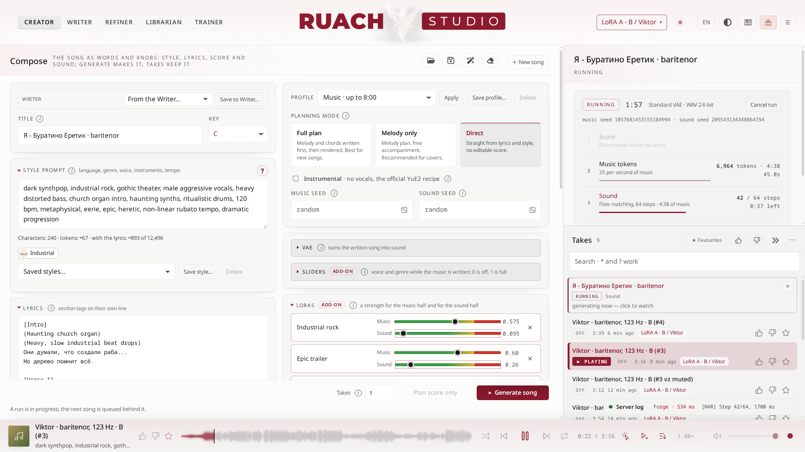

YuE2 ha **due metà**, e quasi tutto ciò che regoli nello studio mira a una delle due:

| metà | cosa fa | cosa governi lì |
|---|---|---|
| **Musica** (AR, il modello linguistico) | scrive la canzone: prima una partitura (notazione ABC), poi i token musicali, 25 al secondo | la modalità di pianificazione, la partitura, il seme musicale, la forza musicale di una LoRA |
| **Suono** (NAR + VAE) | trasforma i token in suono | il seme sonoro, il VAE, la forza sonora di una LoRA, i passi e il risolutore |

### Le cinque stanze <!-- #the-five-rooms -->

| stanza | a cosa serve |
|---|---|
| **Creatore** | il modulo della canzone e il take che stai ascoltando |
| **Scrittore** | le tue canzoni come documenti con versioni; un modello di chat scrive bozze e rivede con te |
| **Rifinitore** | dopo il render: spettro, artefatti, antironzio, verifica del testo, stem, remaster, upscale |
| **Bibliotecario** | tutti i take: spazi, ricerca, mi piace, note, azioni in blocco, il cestino |
| **Addestratore LoRA** | adattatori LoRA dalle tue canzoni: il set, l'esecuzione, la sua telemetria e le sue epoche |

### La barra <!-- #the-bar -->

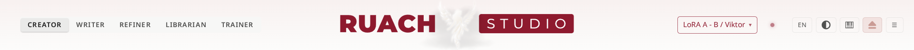

Le stanze aprono la barra; il logo sta al centro; a destra, lo spazio, la spia del motore (verde: pronto; ambra: al lavoro; rossa: qualcosa non è andato) e i pochi pulsanti. Il puntatore sulla spia (o un clic) apre **cosa gira e cosa aspetta**: le canzoni, le rigenerazioni e il lavoro del laboratorio sulle schede video (copertine, stem, upscale, Whisper). Ciò che aspetta esce dalla sua coda con la sua ✕, premuta due volte (la prima pressione chiede conferma); ciò che gira già si ferma dove è mostrato: una canzone nella sua esecuzione, un addestramento nell'Addestratore.

- **Spazio**: lo spazio in mano. L'elenco dei take mostra solo quello, e ogni nuovo take vi finisce dentro. *Tutti gli spazi* mostra tutto. Dove la barra è stretta (il logo senza le sue parole), se ne va anche la parola *Spazio*; il selettore resta.
- **IT** (le due lettere della lingua): la pagina in un'altra lingua, salvata con le tue impostazioni: English, Русский, Українська, Беларуская, Ελληνικά, Español, Italiano, ognuna chiamata con le sue parole. Numeri e date seguono la lingua, e questa guida si apre in essa.
- **☀ / ☾**: giorno, notte o come dice il sistema.
- **Salva** un prompt (tutto il modulo) come JSON o YAML; **Svuota** il modulo.
- **DAW**: la via d'uscita dallo studio. O la traccia mixata così com'è (WAV, FLAC, MP3), o l'intero take nella tua DAW, dove il resto avviene fuori dallo studio. La pagina trova REAPER, Waveform e Bitwig sulla macchina dello studio, oppure indichi tu la tua. Ogni take esce dal suo menu (clic destro): *Esporta in una DAW → Progetto REAPER* o *DAWproject* (Waveform, Bitwig, Studio One, Cubase), la tua DAW per prima; la scheda DAW di questa guida dice cosa c'è dentro.
- **?**: questa guida, aperta sulla stanza in cui sei.
- **☰**: il resto. La scheda video e la sua memoria, la copia del modello, i temi, aprire un prompt salvato, esempi, rilasciare il modello, la stanza del Motore e questa guida.

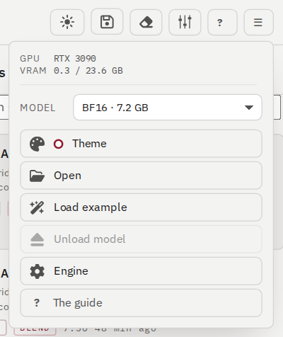

### La tua prima canzone, in sei passi <!-- #your-first-song-in-six-steps -->

1. Dalle un **Titolo** e scegli la **Tonalità** se ne hai una in mente (o lascia *come è scritta*).
2. Scrivi il **Prompt di stile**: lingua, genere, voce, strumenti, tempo. Una o due righe semplici bastano. Il ♪ lì accanto elenca 200 strumenti con ciò che YuE2 suona davvero (vedi *Creatore*).
3. Incolla il **Testo** con i tag di sezione su righe a sé: `[Verse]`, `[Chorus]`, `[Bridge]`, `[Outro]`.
4. Lascia **Piano completo** come modalità di pianificazione: YuE2 scrive prima melodia e accordi, poi la canzone.
5. Premi **Genera canzone**. L'esecuzione mostra le sue fasi: la partitura, i token musicali, il suono, la decodifica.
6. Il take si apre al centro, con il suo lettore, la sua partitura e tutto il necessario per rifarlo.

> Misurato su una RTX 3090: una canzone di 6:12 in modalità Diretto ha richiesto 126 secondi, una di 7:25 in Piano completo 198 secondi (prima si scrive la partitura). Le canzoni più brevi sono più rapide.

### Il lettore, i take e il log del server <!-- #the-player-the-takes-and-the-server-log -->

- **Il lettore** in basso: la forma d'onda da un lato all'altro, una nuvola morbida con la parte già ascoltata nel colore d'accento (un clic salta lì); sotto, il take (la sua copertina quando ce l'ha, il titolo, le prime parole dello stile, 👍 👎 ★), poi **casuale**, precedente, riproduci, successivo e **ripeti** (spento · tutto l'elenco di nuovo · questo take di nuovo, segnato 1), poi il tempo (un clic sulla durata totale lo trasforma nel tempo rimanente), *riproduci al clic* (un clic in un elenco riproduce subito il take), *continua a riprodurre* (quando un take finisce, parte il successivo dell'elenco), la **velocità** (da 0.50× a 2.00×, l'intonazione conservata), il volume e un punto di stato (pulsa mentre suona un take). Ciò che non ti serve in quel momento resta tenue finché non arriva il puntatore; ogni icona dice cosa fa quando il puntatore ci si posa. Il puntatore sulla forma d'onda mostra il tempo a cui salterebbe un clic. I tasti multimediali della tastiera e di una cuffia governano il lettore, e il pannello multimediale del desktop mostra il take.
- **La linea verso lo studio** appare accanto al log del server (*Forge · 85 ms*, o *qui* sulla stessa macchina). Quando lo studio è lontano, un mi piace, un preferito o un fissaggio si vedono subito e lo studio li conferma soltanto.
- **Take** a destra: cerca con parole, `*` e `?`; *Preferiti*; richiudi la colonna con »; ⋯ per le azioni proprie dell'elenco.
- **Il log del server** sta proprio sopra il lettore in ogni stanza: chiuso, mostra l'ultima cosa detta dal motore (in rosso quando qualcosa non è andato); aperto, dieci righe, *Segui*, *Copia* e la via al log completo nel Motore.

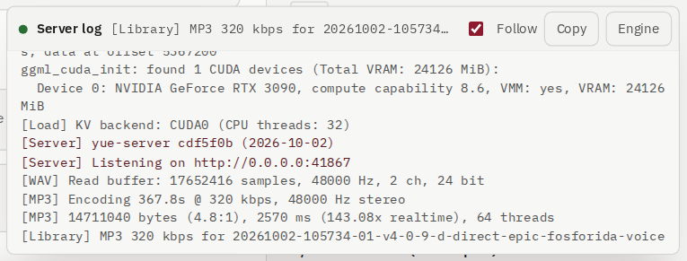

## Creatore <!-- #creator -->

### Composizione: il modulo della canzone <!-- #compose-the-song-form -->

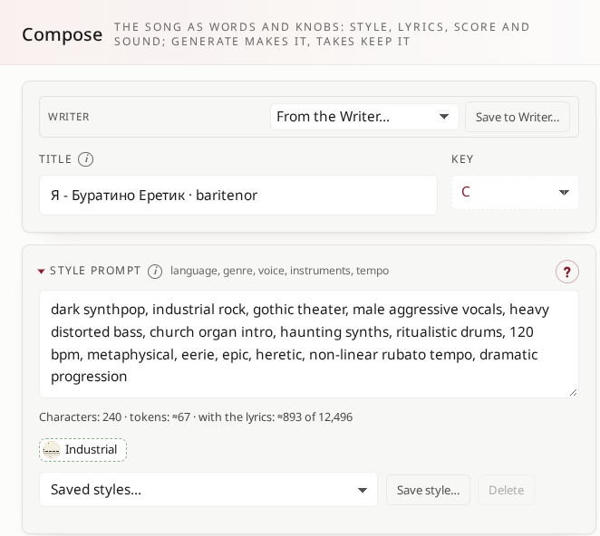

- **Parti da un'idea**: una riga sulla canzone; il modello di chat dello Scrittore abbozza il titolo, lo stile e il testo (*Scrivi il brief*).
- **Titolo**, **Tonalità**: la tonalità entra nella partitura (`K:`). Con una partitura nel modulo, una nuova tonalità la sposta lì; senza, la scelta aspetta e sposterà la partitura che arriva.
- **Seme musicale** e **Seme sonoro**: i dadi delle due metà. Vuoto è casuale; un numero ripete un take. Tieni il seme musicale e cambia quello sonoro per sentire la stessa canzone resa in modo diverso.
- **Prompt di stile**: lingua, genere, voce, strumenti, tempo. *Salva stile…* lo conserva con un nome.

### Il prontuario degli strumenti ♪ <!-- #the-instruments-cheat-sheet -->

Il ♪ accanto allo stile apre una tabella di 200 strumenti che lo studio ha provato: la loro famiglia, la loro terra, come suonano (in inglese e in russo) e le parole che li chiamano. ▶ A e ▶ B riproducono due prove di 60 secondi di ciascuno. Il verdetto di ogni riga lo dà un orecchio umano: sentito, in dubbio o **NOT IDENTIFIED IN YUE2** (YuE2 non lo conosce; serve un prompt più elaborato). Un clic mette il nome dello strumento nello stile.

**È YuE2 a decidere quando entra uno strumento.** Una riga di stile è una richiesta, non un ordine: per quanto insisti, il modello porta dentro uno strumento dove il suo addestramento dice che la canzone lo vuole, e il seme decide moltissimo. Lo stesso prompt ha dato un take con lo strumento e uno senza. Ascolta più semi prima di giudicare uno strumento.

**Si sente, ma non vero come uno dal vivo.** Molti strumenti suonano davvero, ma meno nitidi e meno veri di quelli reali: è ciò che YuE2 sa di loro. I verdetti dicono se YuE2 suona uno strumento oppure no, non quanto suona vero. Renderlo vero è il compito di una **LoRA di strumento**: qualche decina di sue registrazioni pulite, addestrate nell'Addestratore LoRA.

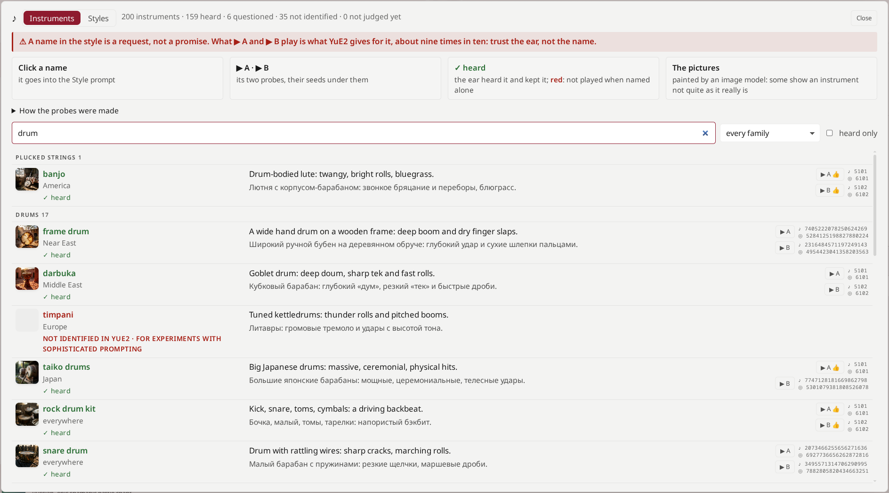

### Testo e profili del testo <!-- #lyrics-and-text-profiles -->

- Tag di sezione su righe a sé; YuE2 conosce `[Intro]`, `[Verse]`, `[Pre-Chorus]`, `[Chorus]`, `[Bridge]`, `[Interlude]`, `[Inst]`, `[Outro]`.
- **Profilo del testo**: incolla un testo intero, scegli un profilo, *Applica*: le sue regole (pulizia, fonetica) e la sua forma (`[Intro]`, `[Verse]` alle righe vuote, `[Interlude]` dopo i paragrafi lunghi) lo rendono pronto da leggere. *Annulla* riporta il testo indietro. I profili si creano nello Scrittore.

### VAE, slider e LoRA <!-- #vae-sliders-and-loras -->

- Il **VAE** trasforma la canzone scritta in suono: **Standard** (il suono migliore), **Precedente** (quello dei benchmark), **Miscela** (una miscela dei due, un componente aggiuntivo). Un take finito può aggiungere più tardi un'altra decodifica dalla sua pagina.
- **Slider**: modellatori di genere e di voce applicati mentre la musica viene scritta; 0 è spento, 1 è pieno.
- **LoRA**: adattatori per la metà musicale, quella sonora o entrambe, ognuno con la sua forza.

**La curva di uno slider.** Uno slider spinge con la sua forza dal primo secondo all'ultimo: piatta. La piccola immagine accanto alla sua forza apre la sua curva: **Arco** la fa salire alla forza piena a metà canzone e calare dolcemente ai due estremi; **Disegna** la modella a mano: trascina un punto in alto per un lampo, in basso per una dissolvenza, lungo la canzone per spostarlo; doppio clic aggiunge un punto, doppio clic su un punto lo toglie. La forza che imposti è la cima della curva. La curva percorre la musica mentre viene scritta, dal primo fotogramma alla fine della durata della canzone, ed entra nella richiesta del take, così un take rifatto percorre la stessa curva.

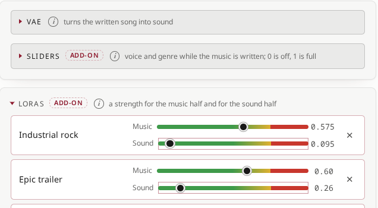

Ogni forza sta su una **strada**: il verde è sicuro, il giallo è il suo limite, il rosso è oltre. I limiti sono misurati:

- un adattatore di partitura (uno che pianifica l'ABC) fino a 1.0 nel verde; ogni altra metà musicale fino a 0.5 nel verde, 0.75 al massimo; gli adattatori addestrati in questo studio sono più severi sulla metà musicale (0.5 nel verde, 0.6 di limite);
- la metà sonora fino a 1.0 nel verde, 1.5 di limite;
- **Musica, nell'insieme**: gli adattatori impilati si sommano. Ognuno può stare nel proprio verde e la somma rompere comunque la partitura. Misurato su take reali: integra fino a **2.25** nell'insieme, rotta da **2.5**. La barra sotto gli adattatori mostra la somma sulla stessa strada.

**Doppio clic** su un numero per scrivere una forza esatta. Le indicazioni sotto il blocco dicono ciò che conta: una parola trigger che manca nello stile, un adattatore addestrato in un'altra modalità di pianificazione, una forza oltre il suo limite.

> **Un adattatore di partitura strumentale con parole da cantare.** Un adattatore del genere pianifica partiture *senza linea vocale*. A 1.00 ha dato un take con una sola nota in 127 battute vocali: il cantante parlava sopra due battute in loop. Con un testo, tienilo basso, da 0.3 a 0.5. Il blocco LoRA lo segnala quando succede.

### Profili e modalità di pianificazione <!-- #profiles-and-planning-modes -->

- **Profilo** imposta in un colpo la modalità, la durata, il campionamento, la guida, i passi, il VAE, gli slider, le LoRA e l'uscita; i testi e i semi restano. *Salva profilo…* conserva le manopole attuali con un nome.
- **Modalità di pianificazione**:
  - **Piano completo**: prima si scrivono melodia e accordi (una partitura modificabile), poi la canzone. La scelta migliore per canzoni nuove.
  - **Solo melodia**: un piano della melodia, accompagnamento libero. Consigliato per le cover.
  - **Diretto**: direttamente dal testo e dallo stile, senza partitura. Gli adattatori addestrati senza partitura vanno qui.
  - **Strumentale**: senza voci, la ricetta ufficiale di YuE2.

### Cover, remix e la tua partitura <!-- #covers-remixes-and-your-own-score -->

- **Cover o remix**: prendi la melodia di una registrazione (*Trascrivi*: solo la sua melodia, non le parole né il cantante), o la melodia di uno dei tuoi take, e dalle un nuovo stile.
- **La tua partitura**: una partitura ABC, seguita in Piano completo e in Solo melodia. Trasponila (alla più vicina, in su o in giù), sposta una voce per gradi della scala, importa un file MIDI (una linea melodica per voce), esporta MIDI o marcatori per una DAW, carica un esempio, rendila strumentale.

### Campionamento <!-- #sampling -->

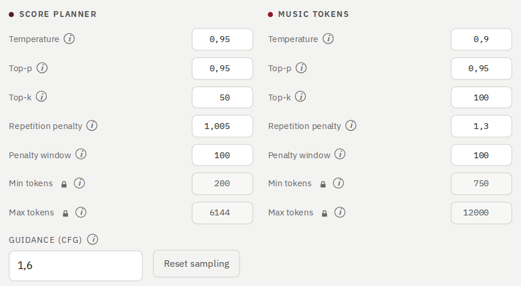

I valori predefiniti sono già tarati. Le tre righe di **forma** (Composizione, Interpretazione, Influenza dello stile) muovono le manopole insieme, in cinque passi; le manopole vere e proprie sono più sotto.

- **Pianificatore della partitura** e **Token musicali**: temperatura, top-p, top-k, penalità di ripetizione, finestra della penalità.
- **Token minimi** e **Token massimi** sono **bloccati** contro una modifica involontaria: fai clic sul 🔒 accanto al nome per cambiarli, e di nuovo per bloccarli. I minimi sono fusibili: una partitura non può finire prima di 200 token, la musica non prima di 750 (30 secondi; una durata richiesta più breve lo abbassa a quella durata).
- Ogni manopola è tenuta entro limiti sensati; un valore oltre viene riportato indietro, e la pagina lo dice.
- **Guida (CFG)**: 1.6 per impostazione predefinita in ogni modalità.
- **Passi ODE** e **Risolutore** per la metà sonora; **Durata massima** in secondi; **Variazioni sonore** rende la stessa musica da 1 a 9 volte con un suono diverso; **Formato**: WAV a 24 bit, 16 bit, 32 bit in virgola mobile o MP3.

### Pianifica solo la partitura, e Genera <!-- #plan-score-only-and-generate -->

- **Pianifica solo la partitura** scrive la partitura e si ferma: leggila, modificala, e allora *Genera* rende esattamente quella partitura. Una partitura già presente nel campo viene prima cancellata.
- **Genera canzone** fa tutto. L'esecuzione mostra le sue fasi man mano.

### Babele nella partitura <!-- #babel-in-the-score -->

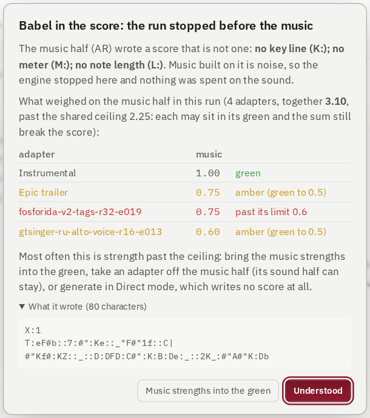

Quando la metà musicale scrive spazzatura al posto di una partitura (gli adattatori spinti oltre i loro limiti fanno questo: niente tonalità, niente metro, due punti a raffica), **il motore ferma l'esecuzione prima di farci sopra qualsiasi musica**, in secondi invece che in minuti. La finestra dice perché, quali adattatori hanno pesato sulla metà musicale e di quanto oltre i loro limiti, mostra ciò che è stato scritto e può riportare le forze musicali nel verde con un clic.

### Il take <!-- #the-take -->

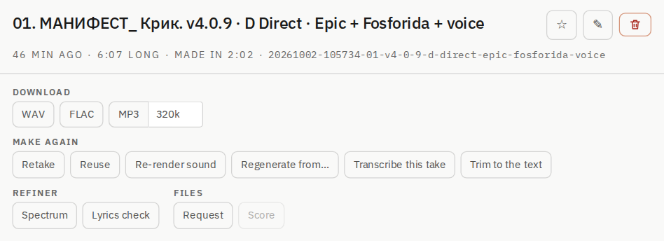

- **Scarica**: WAV, FLAC (gli stessi campioni, circa tre quarti della dimensione), MP3 al bitrate che scegli.
- **Rifai**: *Nuovo take* (un take nuovo dalla stessa richiesta), *Usa come base* (la richiesta di nuovo nel modulo), *Rifai il suono* (la stessa musica, suono nuovo), *Rigenera da…* (tieni l'inizio, riscrivi il resto), *Trascrivi questo take*, *Taglia al testo* (taglia una coda dopo l'ultima riga cantata).
- **Rifinitore**: *Spettro*, *Verifica del testo*. **File**: la richiesta e la partitura.
- **Nota**: cosa funziona, cosa sistemare, dove va.
- La scheda sotto dice come è stato fatto: modalità, formato, VAE, modello, passi, la forma, gli slider, le LoRA con le loro forze, entrambi i semi (copiali per ripeterlo).

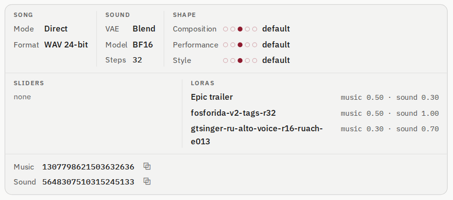

### La partitura <!-- #the-score -->

Il piano del take come pentagramma o come ABC: stampalo in PDF (US Letter, verticale o orizzontale), esporta MIDI o marcatori, *Modifica e rifai*, o aprilo a schermo intero.

## Scrittore <!-- #writer -->

### Le canzoni come documenti <!-- #songs-as-documents -->

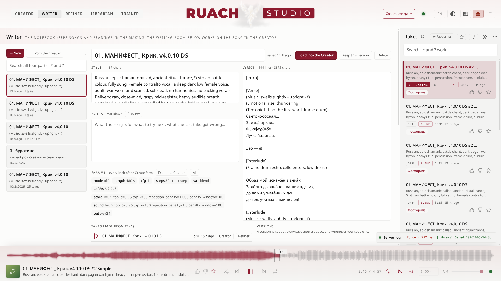

Ogni canzone può vivere nello Scrittore come un documento: il suo **stile**, il suo **testo**, le sue **note** (Markdown, con anteprima) e i suoi **parametri** (ogni manopola del modulo del Creatore). *Nuovo*, *Dal Creatore* (il modulo così com'è), *Carica nel Creatore*.

- **Versioni**: *Conserva questa versione* in qualsiasi momento; *Ripristina questa versione* o prendila *Come nuovo documento*.
- **Take nati da questo**: ogni take la cui richiesta è venuta da questo documento.
- **La canzone ora**: titolo, stile, la tonalità, il metro e il tempo della partitura (lo stile deve concordare con essi), il testo; *Modifica nel Creatore*.

### Profili del testo <!-- #text-profiles -->

Come un testo incollato diventa pronto da leggere: regole di sostituzione in ordine (letterali o espressioni regolari), poi la forma (`[Intro]`, `[Verse]` alle righe vuote, `[Interlude]` dopo i paragrafi lunghi). *+ Regola*, poi **Provalo dal testo** mostra cosa ne esce prima di salvare.

### La stanza di scrittura <!-- #the-writing-room -->

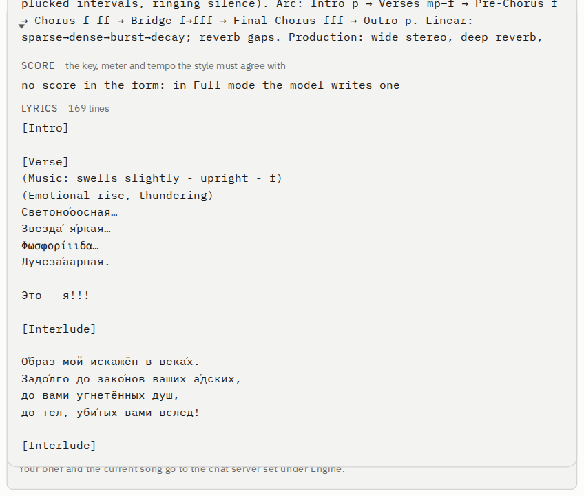

Un modello di chat legge il tuo stile, il tuo testo e la tua partitura, poi li abbozza o li rivede. **Nulla cambia finché non lo applichi.**

- **Di cosa parla la canzone?** o cosa cambiare; **Aiutami con** lo stile, il testo o entrambi; **Struttura**: l'ordine delle sezioni per un testo nuovo.
- Il modello: un server di chat locale (vLLM, LM Studio, Ollama: qualunque cosa con un endpoint di chat `/v1`, impostato nel Motore) o qualsiasi modello di OpenRouter con la sua chiave API.
- *Crea una bozza*, poi **Applica la bozza**, **Usa il testo** o **Usa lo stile**; *Annulla* torna indietro.

## Rifinitore <!-- #refiner -->

### Dopo il render <!-- #after-the-render -->

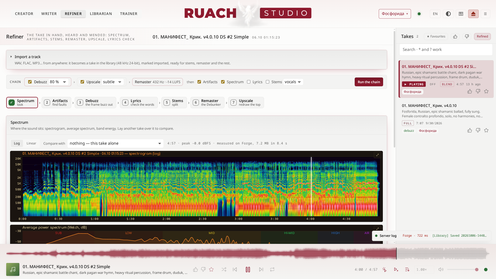

Scegli un take a destra; gli strumenti lavorano su di esso, o su un suo stem. La colonna a destra tiene **i take rifiniti qui**, la rifinitura più recente per prima (*Rifiniti* accanto a *Preferiti* la passa a tutti i take, per cominciarne uno nuovo), e dopo un ricaricamento la stanza torna al take che stava rifinendo.

Tutto ciò che nasce da un take pende dal suo **albero** (*Nato da questo take*), il più nuovo in cima: prima **l'originale**, con il suo lettore e il suo FLAC, poi ogni ramo, riproducibile e utilizzabile come sorgente del passo successivo. Ciò che gira si vede dove guardi: nella testata della stanza, in cima al blocco del passo stesso e come un punto che pulsa sulla sua scheda. Il blocco di ogni passo elenca ciò che ha fatto per il take (*Creato qui*: un clic lo trova nell'albero), e il passo aperto illumina i propri rami.

**Confronta tutte** (sulla riga dell'originale, o *Confronta* su qualsiasi ramo) apre ogni versione in un solo lettore, come SUNO passa da una versione all'altra: l'originale, quello passato dall'antironzio, i remaster, gli upscale, gli stem. Un clic su un'altra versione, o il suo numero (1–9), la riproduce **dallo stesso secondo**; la barra spaziatrice riproduce e mette in pausa, ← → spostano di cinque secondi, Esc chiude.

### Importa una traccia <!-- #import-a-track -->

WAV, FLAC, MP3… da ovunque: diventa un take della libreria (48 kHz, 24 bit), segnato come *importato*, pronto per stem, remaster e il resto. Il testo è facoltativo; la verifica del testo confronta con esso.

### I passi e la catena <!-- #the-steps-and-the-chain -->

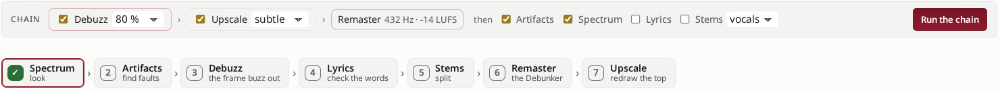

La **catena** esegue più passi in un colpo: *Antironzio → Upscale → Remaster*, poi uno qualsiasi tra *Artefatti*, *Spettro*, *Testo*, *Stem*. Uno per uno:

1. **Spettro**: spettrogramma, spettro medio, energia per bande; sovrapponi un altro take per confrontare.
2. **Artefatti**: un tono che non se ne va, il ronzio a 25 frame del VAE negli acuti, clic, clipping, buchi, uno stereo che si fa la guerra da solo. Un clic su un tempo riproduce da lì.
3. **Antironzio**: il decoder di YuE2 scrive il suono in frame di 1920 campioni, 25 al secondo, e i suoi acuti tremano con essi. Questo passo toglie la parte legata a quell'orologio dei frame sopra i 2 kHz. 80 % è la scelta dell'orecchio; 100 % assottiglia l'attacco.
4. **Testo**: Whisper ascolta e confronta ciò che sente con il tuo testo, minuto per minuto; *Sincronizza le righe* per i tempi del karaoke. Sullo stem vocale sente le parole senza la musica.
5. **Stem**: voce + strumentale (BS-Roformer), o quattro stem (+ htdemucs_ft per batteria, basso e il resto).
6. **Remaster**: mixa gli stem o usa il take così com'è; pulizia, de-esser, a scelta riaccordatura 440 → 432 Hz, loudness (LUFS) e true peak. Ogni passata è un nuovo ramo. Il preset e il de-esser agiscono sugli stem prima del mix: con il take o un qualsiasi file singolo come sorgente (e nella catena) sono spenti.
7. **Upscale**: UniverSR ridisegna la parte alta dello spettro; l'originale resta campione per campione sotto il taglio.

## Bibliotecario <!-- #librarian -->

### Tutti i take <!-- #every-take -->

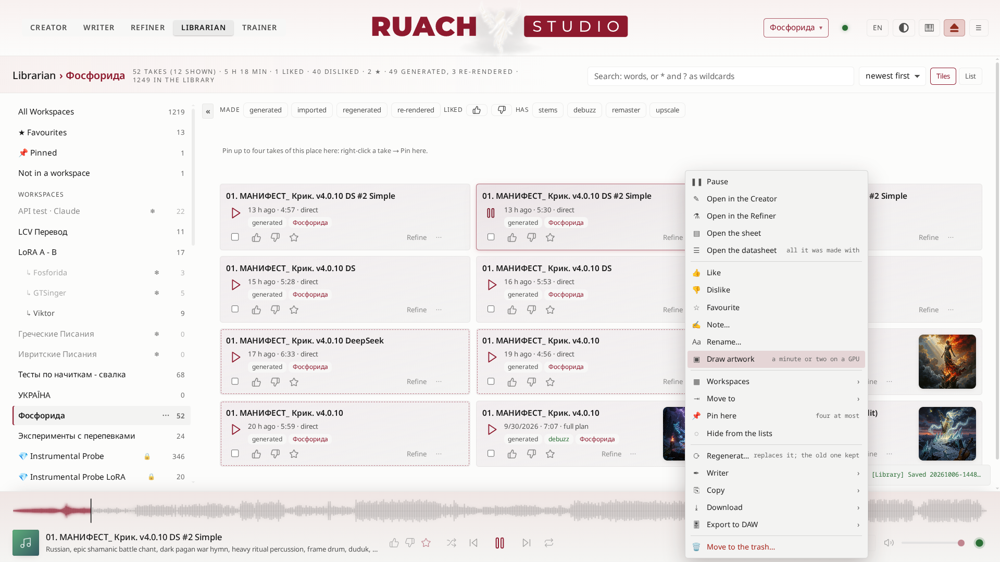

- **L'intestazione** nomina la raccolta aperta (*Bibliotecario › Fosforida*) e ciò che contiene: take, ore, mi piace, preferiti, note, come sono stati fatti.
- **Spazi** a sinistra: Tutti, Preferiti, Senza spazio, i tuoi spazi, *+ Nuovo spazio*; Nascosti e il Cestino, in *Lontano dagli occhi*. Clic destro su uno spazio per i suoi **blocchi** (*Blocca l'eliminazione dello spazio*, *Blocca l'eliminazione dei take*): un 🔒 accanto al suo nome, e niente di ciò che contiene va nel cestino.
- **Cerca** con parole, `*` e `?`; **ordina** per più nuovi, più vecchi, per titolo, più lunghi; **Riquadri** o **Elenco**: tutti e tre nella riga dell'intestazione, accanto ai conteggi.
- **Una scheda** porta la copertina del suo take nell'angolo in alto a destra, accanto al titolo, quando ce l'ha (*Disegna la copertina* nel menu del take); un clic mostra l'immagine intera sopra lo studio, dove ‹ › e i tasti freccia scorrono le immagini delle schede mostrate, ▶ riproduce il suo take ed Esc chiude. La scheda che suona brilla dei picchi della canzone stessa.
- **Take freschi**: un take che non hai ancora riprodotto porta una leggera linea tratteggiata; il suo primo ascolto la toglie. Un take rigenerato porta un'etichetta *regen* e conserva la sua nota, il suo mi piace e la sua stella.
- **La colonna degli spazi**: trascinane il bordo per allargarla o restringerla; « la richiude, e le schede guadagnano una colonna in più.
- **Sezioni**: uno spazio può avere sezioni, al massimo due livelli di profondità (⋯ accanto al suo nome → *Nuova sezione…*), per ordinare ciò che contiene senza un nuovo spazio ogni volta. Uno spazio mostra anche i take delle sue sezioni. Tutto ciò da cui il Rifinitore ricava qualcosa va da solo nella sezione *Rifiniti* dei suoi spazi.
- **Trascina una scheda su uno spazio** a sinistra per spostarla lì (tutte le selezionate, quando è selezionata); tieni premuto **Ctrl** per aggiungerla lì e lasciarla anche qui. Lo studio chiede prima, e Ctrl+Z la riporta indietro.
- **Take fissati**: fino a quattro in ogni spazio, in una striscia del loro tono sopra le schede (clic destro su un take → *Fissa qui*; × lo sgancia). Quando selezioni dei take, la barra dei selezionati prende il posto della striscia, così le schede non si spostano mai.
- **Filtri**: come è stato fatto (generato, importato, rigenerato, ri-renderizzato), con mi piace o no, cosa ha (stem, antironzio, remaster, upscale).
- **Seleziona** più take, come in un file manager: selezionane uno, e da lì un clic in qualunque punto di un'altra scheda la seleziona a sua volta (Shift: tutto l'intervallo). Un trascinamento nello spazio vuoto tra le schede disegna una banda che seleziona ciò che tocca; **Ctrl+trascinamento** la disegna da qualunque punto e conserva ciò che era già selezionato. La barra dei selezionati galleggia sopra il lettore: preferito, aggiungi a uno spazio, sposta in uno spazio, togli da questo, nascondi, esporta uno ZIP, nel cestino.
- **Il cestino** restituisce, o cancella per sempre dopo la tua conferma.

### Il menu di un take <!-- #a-take-s-menu -->

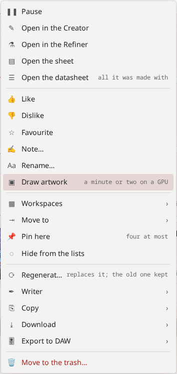

**Rigenera con un nuovo seme** (sopra lo Scrittore nel menu del take): il take rifatto con tutto ciò con cui era stato fatto, ma con semi nuovi; il nuovo eredita gli spazi e la nota del vecchio, e il vecchio aspetta nella sezione *Sorgente della rigenerazione* del suo spazio (il suo spazio non lo mostra tra i propri) finché non la svuoti; il nuovo conserva la sua nota, il suo mi piace, la sua stella e la sua immagine. Una prova esce con i suoi due minuti interi. Riproduci, apri nel Creatore o nel Rifinitore, il foglio (la sua partitura), la scheda tecnica (tutto ciò con cui è stato fatto: lo stile e il testo, la partitura disegnata, ogni manopola, le LoRA e gli slider con le loro forze; un take in modalità Diretto non ha partitura, e *Scrivila dal suono* ne chiede una al trascrittore), mi piace, non mi piace, preferito, una nota, rinomina, **spazi** (un take può stare in più spazi), **sposta in** uno spazio (su una scheda selezionata: ogni take selezionato, fuori dallo spazio aperto), nascondi, manda allo Scrittore, copia, scarica, **esporta in una DAW** (progetto REAPER o DAWproject, su qualsiasi take: con i suoi stem una volta che il Rifinitore li ha separati), nel cestino.

**Disegna la copertina**: un piccolo modello linguistico (Qwen3-4B) legge lo stile e le parole del take e scrive un prompt per un'immagine; un modello SDXL (CyberRealistic XL) la dipinge, a 768 px, in circa mezzo minuto su una scheda da 16 GB. Si vede nel lettore, sulla scheda, nel pannello multimediale del desktop e dentro l'MP3 che scarichi (come sua copertina). Quando un take ha la sua immagine, il menu dice *Apri la copertina* (sopra la pagina, come un clic sull'immagine della scheda o sul quadrato del lettore) e *Ridisegna la copertina* (un nuovo prompt e una nuova immagine). I due modelli arrivano con `heresy/fetch-heresy.sh --artwork` (14 GB, chiede prima).

### Gli strumenti sotto lo stile <!-- #the-instruments-under-the-style -->

Sotto il Prompt di stile, lo studio nomina ciò che il tuo prompt chiede: un chip per ogni strumento e stile del prontuario che trova, colorato secondo ciò che ha trovato l'orecchio (verde sentito, ambra in dubbio, rosso non suonato con quel nome) e con l'immagine dello strumento. Posa il puntatore su uno per la sua scheda: l'immagine, la sua terra, come suona, ▶ A e ▶ B con i loro semi. Un clic mostra l'immagine intera. **Alt+I** apre il prontuario da qualunque punto.

### Copertine: cosa le disegna, cosa non sa fare, un altro pittore <!-- #artwork-what-draws-it-what-it-cannot-another-painter -->

**Cosa le disegna.** Un piccolo modello linguistico (Qwen3-4B) legge lo stile e le parole del take e scrive un prompt per un'immagine, il soggetto per primo; un modello SDXL la dipinge (1024 px, conservata a 768). Quando il take porta il nome di uno strumento (la prova di uno strumento), lo studio dice a entrambi com'è fatto lo strumento e di dove è, e Omni (il modello dell'ascoltatore) guarda l'immagine: quando non trova lo strumento, riscrive il prompt da ciò che ha visto, e il pittore ci riprova, al massimo tre immagini. Circa mezzo minuto per immagine su una scheda da 16 GB.

**Cosa non sa fare** (un'avvertenza, detta senza giri di parole): il pittore disegna ciò che conosce. Uno strumento che non ha mai visto per nome (il duduk, il morin khuur, il khomus, le campane tibetane di cristallo…) esce come un'ipotesi: un flauto di legno, un violino, ciotole da cucina. Dove Omni non ha trovato lo strumento in nessuna delle tre immagini, l'immagine è segnata **≈ un'ipotesi**, nella vista sovrapposta e nel prontuario degli strumenti. Una copertina è l'umore del take, non un'immagine di riferimento di uno strumento: per sapere com'è fatto uno strumento, cercalo.

**Consiglio da pro: un altro pittore.** Lo studio dipinge con l'SDXL a cui punta il link `artwork/SDXL-Artwork-Model`; il nostro è `CyberRealistic-XL-v10`. Metti accanto un altro finetune di SDXL, come cartella diffusers o come un unico file `.safetensors` (come li dà Civitai), e punta il link su di esso, in relativo:

```bash
cd artwork && ln -sfn MyFavourite-XL.safetensors SDXL-Artwork-Model
```

e per tornare: `ln -sfn CyberRealistic-XL-v10 SDXL-Artwork-Model`. L'immagine successiva lo usa già, senza riavvio. **Funzionano solo i finetune di SDXL**: SD 1.5, SD 3, FLUX e le altre famiglie vengono rifiutati, e lo studio dice cosa ha trovato al loro posto. Un finetune Turbo, Lightning, Hyper o LCM vuole pochi passi e poca guida: quando il suo nome lo dice, lo studio lo fa dipingere con 8 passi, guida 2 ed Euler ancestral. Per qualunque pittore, un file accanto al link fissa i suoi numeri: `artwork/SDXL-Artwork-Model.json` con `{"steps": 6, "cfg": 1.5, "sampler": "euler_a"}` (o `"dpmpp"`, quello dello studio).

## Addestratore LoRA <!-- #lora -->

### Cosa insegna una LoRA a YuE2 <!-- #what-a-lora-teaches-yue2 -->

Una LoRA è un piccolo adattatore sopra entrambe le metà. **Lo stile viene soprattutto dalla metà sonora; il seguire il testo, dalla metà musicale**, e la metà musicale impara a memoria i set piccoli in fretta (la sua loss scende verso 0). Tipi:

| tipo | dati | cosa impara |
|---|---|---|
| **Stile** | 20+ canzoni di uno stesso suono | genere, produzione, il suono di una band |
| **Voce** | una sola voce, cantata o parlata: canto (idealmente a cappella), letture, audiolibri | un timbro |
| **Lingua** | molte voci, testi esatti | la dizione di una lingua |
| **Artista** | un catalogo grande e vario | tutto quanto |

**Un adattatore di voce impara da qualsiasi forma della voce**, non solo dal canto: vanno bene anche letture e audiolibri. Misurato qui (05.10.2026): un adattatore addestrato sulle letture di un attore parlava con la sua voce e, cantando, cantava con il suo colore. Chiama un adattatore così per il tipo di voce (basso, baritenore, contralto…), mai per una persona: `lab/voice_kind.py` misura la voce di un set dall'altezza del parlato.

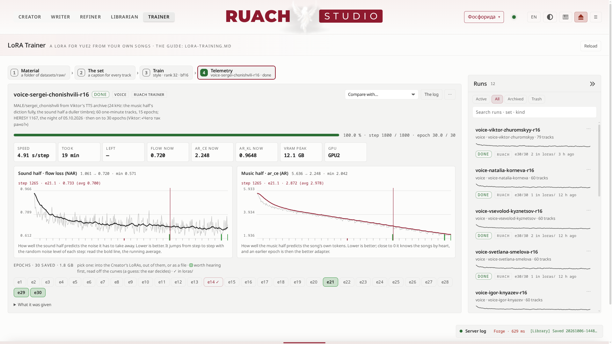

### 1 Materiale <!-- #1-material -->

Metti una cartella di canzoni in `datasets/raw/` e sceglila. Scegli quali tracce entrano, dai a ciascuna il suo testo (trovato accanto per nome quando c'è) e, se le serve, uno stile tutto suo. Le tracce sotto i 30 secondi restano fuori per impostazione predefinita; quelle lunghe vanno bene (la metà musicale si addestra sull'intera canzone).

### 2 Il set <!-- #2-the-set -->

Una **parola trigger** (una parola insolita, per es. `fosforida`) chiama poi lo stile per nome; la **riga di stile comune** dice cosa si sente. *Crea il set* scrive `datasets/prepared/NAME/`: audio a 48 kHz e una didascalia per traccia.

L'**ascoltatore** (Qwen2.5-Omni, su qualsiasi scheda con circa 8 GB liberi) ascolta ogni traccia e ne abbozza i tag; tu li correggi e premi *Scrivi nelle didascalie*. È una bozza a qualunque dimensione: leggila.

### 3 Addestra <!-- #3-train -->

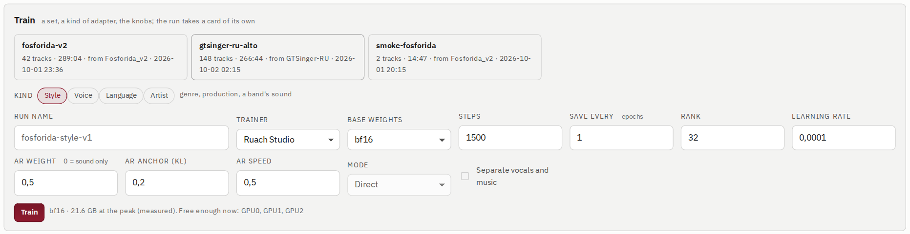

- **Tipo** preimposta le manopole (rango, passi, quanto impara la metà musicale).
- **Addestratore**: **Ruach Studio** (quello dello studio, sui pesi bf16 non quantizzati; si costruisce da sé la cache latente del set) o **AI-Toolkit** di Ostris (il riferimento; sa addestrare anche con una partitura). Entrambi salvano lo stesso formato LoRA; sullo stesso set le loro curve coincidono epoca per epoca.
- **Pesi di base**: bf16 (schede da 24 GB) o int8 (schede più piccole, un po' meno esatto).
- **Passi**, **Salva ogni** N epoche (ogni epoca viene conservata), **Rango**, **Learning rate**, **Peso AR** (quanto impara la metà musicale; 0 = solo il suono), **Ancora AR** (la tiene vicina al modello di base), **Velocità AR**.
- Sotto il pulsante: la VRAM misurata delle esecuzioni precedenti, e quale scheda è abbastanza libera ora.

### Il rango e le altre manopole <!-- #rank-and-the-other-knobs -->

Il **rango** è quanto è ampio il cambiamento dell'adattatore su ogni matrice. Una LoRA adatta 224 matrici di YuE2, 112 per metà; ognuna è larga 2048, profonda 28 strati: 1,41 miliardi di pesi per metà. Quanto costa un rango, misurato su queste forme:

| rango | dei pesi che adatta | file, per metà (bf16) |
|---|---|---|
| 16 | 1 % | 29 MB |
| 32 | 2 % | 59 MB |
| 64 | 4 % | 117 MB |
| 128 | 8 % | 235 MB |
| 256 | 17 % | 470 MB |

- **Una voce, uno strumento, un suono** (da 20 a 50 canzoni): **16**, al massimo 32.
- **Uno stile o un artista** (un catalogo vario): **32**.
- **Un set grande di molte voci** (ore di registrazioni, un tag per ogni voce): **64**, e **128 al massimo**, solo quando 64 resta misurabilmente indietro. L'addestratore si ferma a 128: 256 cambierebbe un sesto dei pesi che tocca, più di quanto serva a qualsiasi set di qui.
- Il file del modello di base non cambia mai. Il rischio di un rango grande è l'adattatore stesso: a piena forza dimentica ciò che non gli è stato mostrato (il canto, se ha imparato dal parlato).
- **Passi**: la metà musicale impara a memoria un set piccolo in fretta (la sua loss scende verso 0): le epoche verdi della Telemetria sono quelle da ascoltare per prime, spesso molto prima dell'ultima.
- **Learning rate**: tieni quello del tipo; più alto impara più in fretta e dimentica di più.
- **Peso AR**: 0 insegna solo il suono (un timbro); alzalo per la dizione e lo stile, che vivono nella metà musicale.
- **La frequenza di campionamento del materiale**: la metà sonora lavora a 48 kHz, quella musicale ascolta a 24 kHz. Una registrazione a 24 kHz insegna tutto alla metà musicale, ma alla sonora solo degli acuti spenti: ricampionare non aggiunge nulla sopra la metà della frequenza originale. Per un timbro, dalle 44,1 o 48 kHz.

### 4 Telemetria <!-- #4-telemetry -->

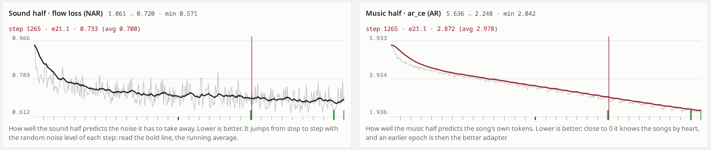

Le esecuzioni in addestramento stanno in cima alla stanza con il loro avanzamento, il tempo rimanente ed entrambe le loss. La telemetria di un'esecuzione mostra avanzamento, velocità, tempo, memoria e due curve:

- **Metà sonora · perdita flow**: quanto bene la metà sonora prevede il rumore che deve togliere. Salta da un passo all'altro (ogni passo estrae un livello di rumore a caso): leggi la linea spessa, la media mobile.
- **Metà musicale · ar_ce**: quanto bene la metà musicale prevede i token della canzone stessa. Vicino a 0 conosce le canzoni a memoria; allora un'epoca precedente è l'adattatore migliore.

Passa il puntatore su una curva per leggere il passo, la sua epoca e il valore in quel punto. **Confronta con…** sovrappone a queste le curve di un'altra esecuzione, tratteggiate.

### Le epoche da ascoltare per prime <!-- #the-epochs-worth-hearing-first -->

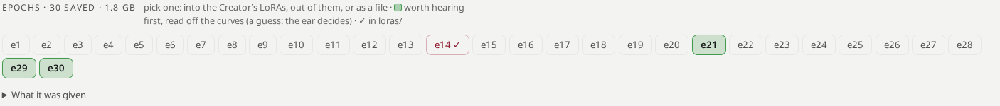

Ogni epoca salvata è un chip. Le **verdi** sono quelle da ascoltare per prime, lette dalle curve: la prima epoca la cui loss sonora si è assestata, quella con la loss sonora più bassa e l'ultima prima che la metà musicale sappia le canzoni a memoria. È un'ipotesi; decide l'orecchio. Scegli un'epoca: **In loras/ → il Creatore** (compare subito tra le LoRA), **Fuori da loras/** o **Scarica**.

> **Un adattatore addestrato senza partitura (Diretto) va sulla metà musicale solo nelle esecuzioni in Diretto.** In Piano completo la sua metà musicale può rompere la partitura anche a forza bassa: lì, dagli solo la metà sonora.

### Esecuzioni <!-- #runs -->

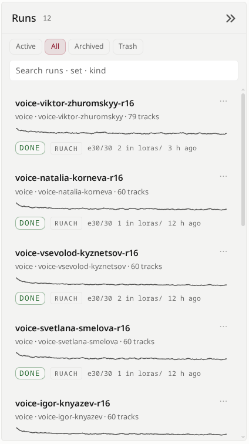

Ogni esecuzione è una scheda a destra: *Attive*, *Tutte*, *Archiviate*, *Cestino*, con ricerca. Un'esecuzione in addestramento si illumina come un take che suona. ⋯ su una scheda: la sua telemetria, il suo log, archiviala, fermala o cancellala nel cestino (ti viene chiesto se i suoi adattatori in loras/ se ne vanno con lei). Dal Cestino torna, o se ne va per sempre.

## Motore <!-- #engine -->

### La macchina <!-- #the-machine -->

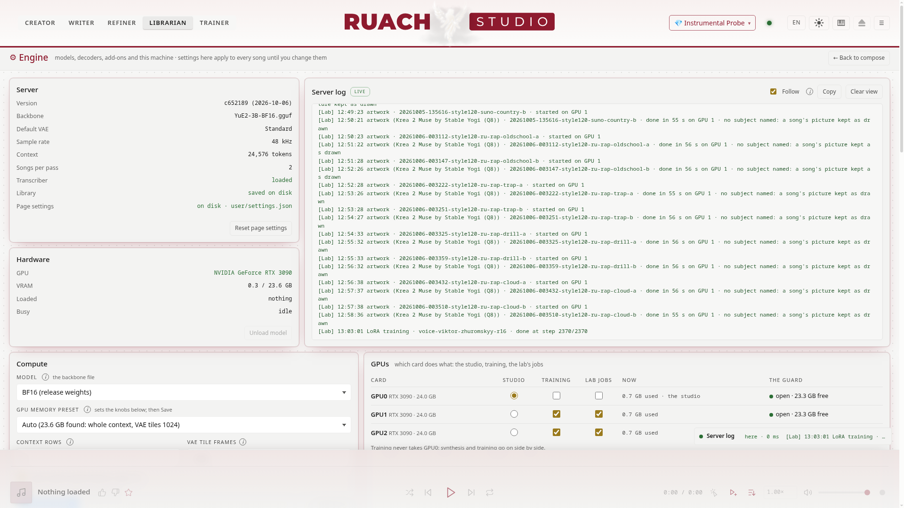

- **Server**: ciò che il motore fa girare: il modello, i decoder, il contesto, la libreria.
- **Calcolo**: la copia del **modello** (BF16 7,2 GB, Q8_0 3,8 GB, Q6_K e Q5_K_M più piccole), **Preimpostazione della memoria GPU** (*Auto* adatta il contesto e le tile del VAE alla scheda; *Manuale* le lascia a te), **Tieni i modelli caricati**.
- **Hardware**: la memoria della scheda ora; **Rilascia il modello** la libera subito.

### GPU: quale scheda fa cosa <!-- #gpus-which-card-does-what -->

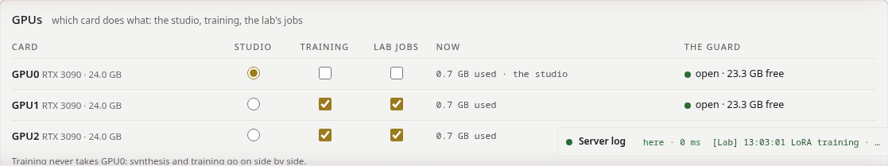

Su una macchina con più schede, dai a ciascuna il suo lavoro: lo **studio** (la sintesi) su una scheda, l'**addestramento** sulle schede che gli assegni, i **lavori** del laboratorio (l'ascoltatore, Whisper, stem, remaster, upscale) sulle loro. Mentre un'esecuzione si addestra sulla scheda dello studio stesso, una sintesi aspetta, e la pagina dice perché. Con una sola scheda funziona così: addestra, poi crea. Una nuova scheda per lo studio ha effetto dopo un riavvio (il pulsante compare quando serve).

### Decoder, adattatori, slider, il modello dello scrittore, l'aspetto <!-- #decoders-adapters-sliders-the-writer-s-model-the-look -->

- **VAE**, **LoRA**, **Slider**: ogni file che lo studio ha trovato, con la sua fonte e ciò che fa.
- **Scrittore**: l'indirizzo del server di chat locale (vLLM, LM Studio, Ollama), *Prova la connessione*.
- **Aspetto**: 22 temi (scelti per crearci dentro: chiari e quieti), gli angoli, i tre caratteri (testo, titoli, numeri).
- **Log del server**: il log intero; **Informazioni**: ogni progetto su cui poggia lo studio, con il suo link.

## DAW <!-- #daw -->

**Sperimentale.** La via verso una DAW funziona ed è stata verificata, ma ha ancora bisogno di crash test su altre macchine e altri progetti, e di altro lavoro.

### Due vie d'uscita dallo studio <!-- #two-ways-out-of-the-studio -->

Lo studio consegna una canzone in uno di due modi, e solo in questi due:

1. **La traccia mixata**, così come l'ha fatta lo studio e rifinita il Rifinitore: WAV, FLAC o MP3, senza DAW in mezzo.
2. **L'intero take nella tua DAW**, come progetto di quella DAW: da lì in poi tutto avviene fuori dallo studio. Non rientra né audio né progetto: lo studio non legge il progetto di una DAW (REAPER può dargli ciò di cui una canzone è fatta: le sue parole e una melodia).

Il pulsante **DAW** nella barra apre questa scelta. La pagina mostra quali DAW ha la macchina dello studio (REAPER, Waveform, Bitwig), con le loro versioni. Quando lo studio gira su un computer diverso da quello della tua DAW (un server a casa, un portatile in viaggio), segna la tua con *Uso questa*.

| DAW | cosa le dà lo studio | stato |
|---|---|---|
| **REAPER** | il suo progetto (.RPP): il mix, gli stem, la partitura come MIDI, tempo e metro, sezioni, testo, la ricetta | pronto, verificato da REAPER stesso |
| **Waveform** (Tracktion), 14 o successivo | DAWproject: il mix e gli stem, la partitura come tracce di note, le sezioni come marcatori, tempo e metro | pronto, verificato sullo schema del formato |
| **Bitwig** | DAWproject, lo stesso | pronto, verificato sullo schema del formato |
| **Studio One, Cubase** (Windows, macOS) | DAWproject, lo stesso | pronto |

### REAPER: installazione <!-- #reaper-install -->

- **Linux**: da reaper.fm, l'archivio *Linux x86_64*; scompattalo ed esegui `./install-reaper.sh`: va in `/opt/REAPER`, senza nient'altro.
- **Windows, macOS**: l'installer da reaper.fm.
- REAPER dà 60 giorni con tutte le funzioni, poi chiede una licenza ($60 per uso personale o una piccola impresa).

### Il progetto più completo: prima tre passi <!-- #the-fullest-project-three-steps-first -->

Ciò che il progetto porta con sé dipende da ciò che ha il take. Per avere tutto:

1. **Piano completo** quando fai la canzone: la partitura diventa le tracce MIDI e dà il tempo e il metro. (Un take in Diretto non ha partitura: niente MIDI; il tempo viene da "NN bpm" nello stile, o resta un 120 provvisorio.)
2. **Rifinitore → Stem**: ogni stem ha la sua traccia (due: voce e strumentale; quattro: con batteria, basso e il resto).
3. **Rifinitore → Verifica del testo**: Whisper mette a tempo ogni riga; le righe arrivano sulla timeline e le sezioni ([Verse], [Chorus]…) diventano regioni.

Nessuno dei tre è necessario: il progetto prende ciò che c'è e dice cosa gli è mancato.

### REAPER: esportare e aprire <!-- #reaper-export-and-open -->

1. Apri il take (nel Creatore, nel Rifinitore o nel Bibliotecario), poi **DAW → REAPER → Esporta il take**; oppure clic destro su qualsiasi take → **Scarica → Progetto REAPER**.
2. Lo studio impacchetta il take: l'audio come WAV a 24 bit a 48 kHz, così una canzone di sette minuti con due stem pesa circa 350 MB. Il browser salva `TITLE.reaper.zip`.
3. Scompattalo dove vuoi, per intero: `TITLE/TITLE.RPP` e `TITLE/audio/` restano uno accanto all'altro.
4. Apri `TITLE.RPP` in REAPER (File → Open project, o un doppio clic).

### Cosa c'è dentro <!-- #what-is-inside -->

| traccia | che cos'è |
|---|---|
| **Mix** | la canzone come l'ha resa lo studio; **muta** quando ci sono gli stem, così suonano gli stem e il mix aspetta come riferimento |
| **Vocals**, **Instrumental** (o Drums, Bass, Other) | gli stem, ciascuno da 0 lungo tutta la canzone |
| **Score · Vocal**, **Score · Ins** | la partitura come MIDI, una traccia per voce. È la partitura *come è stata scritta*: la canzone come è stata cantata può allontanarsene. Non suona finché non le dai uno strumento (l'FX della traccia: ReaSynth, o qualsiasi VSTi) |
| **Lyrics** | ogni riga del testo come un elemento vuoto con la riga nella sua nota, dove Whisper l'ha sentita |

- **Regioni**: le sezioni del testo, dalla prima riga a tempo di ciascuna alla successiva.
- **Tempo e metro**: dalla partitura (il suo `Q:` e il suo `M:`), altrimenti "NN bpm" nello stile, altrimenti 120 in 4/4 come valore provvisorio; le note del progetto dicono quale.
- **Le note del progetto** (nelle impostazioni del progetto di REAPER): il titolo, lo stile, entrambi i semi, il nome proprio del take: la via del ritorno al take nel Bibliotecario.

### REAPER: quando qualcosa non va <!-- #reaper-when-something-looks-wrong -->

| cosa vedi | perché | cosa fare |
|---|---|---|
| media offline | la cartella audio non sta accanto al .RPP | scompatta l'intero ZIP, tieni `audio/` accanto al progetto |
| niente testo, niente regioni | il take non è mai stato messo a tempo | Rifinitore → Verifica del testo, poi esporta di nuovo |
| niente tracce MIDI | un take in Diretto, o uno senza partitura | fallo in Piano completo, o porta la tua partitura nel Creatore |
| il tempo segna 120 | il take non ha un tempo suo | impostalo in REAPER, o scrivi "NN bpm" nello stile la prossima volta |
| il MIDI va avanti o indietro rispetto alla voce | la partitura è il piano, il canto la sua interpretazione | usa il MIDI come schizzo, o allinealo agli stem |
| il testo in ebraico o in greco appare a quadratini | al carattere di REAPER manca quella scrittura | un carattere con quelle scritture nel tema o nelle preferenze di REAPER |

### REAPER: canzoni da dentro REAPER <!-- #reaper-songs-from-inside-reaper -->

Tre azioni di REAPER in `extras/reaper/` (ReaScript, Lua) raggiungono lo studio attraverso la sua API, dalla macchina dello studio stesso o da un'altra della tua rete. Il suono va in un solo senso: le canzoni escono dallo studio verso REAPER, e né audio né progetto tornano indietro. Ciò che REAPER dà allo studio è ciò di cui una canzone è fatta: le sue parole e la sua melodia.

- **Ruach - Generate here**: lo stile, la durata e la modalità, chiesti; la canzone si fa nello studio e arriva su una nuova traccia all'inizio della selezione temporale (lunga quanto la selezione). Il testo viene dalle note degli elementi selezionati (il progetto esportato tiene lì le parole di ogni sezione), o dalla finestra di dialogo. **Gli elementi MIDI selezionati sono la melodia della canzone**: le loro note diventano la sua partitura (si canta la traccia più alta; una traccia di accordi non viene data come linea, perché la melodia potrebbe prenderla uno strumento), al tempo e al metro del progetto, nella tonalità del key snap dell'elemento MIDI o in quella che suggeriscono le note, fatta in modalità *Solo melodia*; le note del nuovo elemento dicono come è stata letta la melodia. REAPER resta libero mentre lo studio lavora.
- **Ruach - Bring a take**: parole (titolo o nota, `*` e `?`), uno spazio se vuoi, e il take che scegli arriva al cursore di modifica.
- **Ruach - Settings**: l'indirizzo dello studio, il suo token se ne chiede uno, e lo spazio in cui arrivano le canzoni da REAPER.

Installazione: copia la cartella negli `Scripts` di REAPER, poi *Actions → New action → Load ReaScript* per tutte e tre, ed esegui *Settings* una volta. Serve `curl` (ce l'hanno ogni Linux, macOS e Windows 10 e successivi). Il README della cartella dice il resto.

### DAWproject (Bitwig, Studio One, Cubase) <!-- #dawproject-bitwig-studio-one-cubase -->

Clic destro su un take → **Scarica → DAWproject**, o *Esporta il take* sulla scheda di Waveform o di Bitwig nella finestra DAW: un file `.dawproject` con il mix e ogni stem (il mix muto quando ci sono gli stem), la partitura come tracce di note, una per voce, le sezioni come marcatori una volta messo a tempo il take, al tempo e al metro del take; lo stile e il testo viaggiano nelle sue note. Aprilo con l'importazione DAWproject della DAW: Waveform 14 o successivo (*File > Import Other > Import a DAWproject file*; lo studio chiede almeno Waveform 14), Bitwig, Studio One, Cubase. Verificato sullo schema del formato stesso (Project.xsd).

### Dai tuoi script <!-- #from-your-own-scripts -->

Tutto quanto sopra è anche l'API dello studio: `POST /api/v1/takes/NAME/reaper` impacchetta il progetto e dice dove prenderlo. Vedi **docs/API.md**: canzoni, lavori, take, segni, spazi, e un server MCP per gli agenti.

## Scorciatoie e trucchi <!-- #shortcuts -->

**Nel Bibliotecario:** **Ctrl+A** seleziona ogni take mostrato, **Esc** nessuno, **Canc** manda i selezionati nel cestino (chiede prima), **Ctrl+Z** annulla l'ultima modifica (uno spostamento, uno spazio, il nascondere, un fissaggio, i segni, il cestino); la pillola sopra il lettore offre lo stesso Annulla per dieci secondi.

### Tasti <!-- #keys -->

| tasto | dove | cosa fa |
|---|---|---|
| **Barra spaziatrice** | ovunque tranne un campo di testo | riproduce o mette in pausa il take in mano |
| **←** **→** (con **Shift**: 30 s) | ovunque tranne un campo di testo o un menu | 5 secondi indietro o avanti |
| **M** | ovunque tranne un campo di testo | suono spento e acceso |
| i tasti multimediali | la tastiera, una cuffia, il pannello multimediale del desktop | riproduci, pausa, precedente, successivo |
| **Esc** | ovunque | chiude ciò che è aperto: un menu, una finestra di dialogo, la guida, una vista a schermo intero, la stanza del Motore |
| **Invio** / **Esc** | una finestra di dialogo, una rinomina sul posto, un valore digitato di una LoRA | conferma / annulla; in una finestra con testo lungo **Shift+Invio** va a capo |
| **Invio** | *Parti da un'idea* | il modello di chat abbozza la canzone; **Shift+Invio** va a capo |
| **Ctrl+S** | lo Scrittore | salva subito il documento |
| **↑ ↓** · **→** · **←** | un menu | muoversi · aprire un sottomenu · uscirne |
| **frecce** | il selettore dei temi | muoversi tra i temi |
| **+** **−** **0** | un pentagramma o uno spettro a schermo intero | ingrandisci, rimpicciolisci, torna ad adattare; **Ctrl+rotellina** ingrandisce dove sta il puntatore |
| **← →** (con **Shift**: passi più ampi) · **Home** | il bordo di una colonna, a fuoco | la colonna più stretta o più larga · di nuovo la sua larghezza |
| **Invio** o **Barra spaziatrice** | la scheda di un'esecuzione nell'Addestratore LoRA | apri l'esecuzione |

### Il mouse <!-- #the-mouse -->

- **Clic destro** su un take ovunque (l'elenco dei take, una scheda, un take fissato) per il suo menu; clic destro su uno spazio per i suoi blocchi, rinominarlo ed eliminarlo.
- **Doppio clic**: un take nell'elenco dei take lo riproduce; il nome di uno spazio lo rinomina; il bordo di una colonna le ridà la sua larghezza; il pentagramma o lo spettro si apre a schermo intero; il valore di una LoRA ti lascia scriverlo esatto.
- **Nel Bibliotecario, come in un file manager**: una volta selezionata una scheda, un clic in qualunque punto di un'altra seleziona anche quella; **Shift**+clic seleziona tutto l'intervallo; un trascinamento nello spazio vuoto tra le schede disegna una banda che seleziona ciò che tocca; **Ctrl**+trascinamento la disegna da qualunque punto e inverte ciò che attraversa: le schede non selezionate si selezionano, quelle selezionate si deselezionano. La pagina scorre quando la banda raggiunge un bordo.
- **Segni per molti**: con più take selezionati, 👍, 👎 o ★ su uno qualsiasi (o sulla barra dei selezionati) li segna tutti; quando tutti hanno già quel segno, viene tolto. Togliere più take da uno spazio chiede prima; il cestino chiede sempre.
- **Passa il puntatore** sul nome troncato di uno spazio: appare intero, sopra la griglia.
- **La velocità** nel lettore (da 0.5× a 2×) conserva l'intonazione: rallenta per sentire un dettaglio, accelera per scorrere.

### Piccoli trucchi <!-- #small-tricks -->

- Tieni il **seme musicale** e cambia il **seme sonoro**: la stessa canzone, resa di nuovo.
- Ascolta uno strumento su **più semi** prima di giudicarlo: YuE2 lo fa entrare quando il seme e la canzone glielo permettono.
- **Fissa** i take a cui torni sempre (quattro in ogni spazio); **Fissati**, a sinistra, li elenca tutti.
- **⋯** su una scheda è il suo menu del clic destro, per un touchpad.

## Consigli <!-- #tips -->

### Quando qualcosa va storto <!-- #when-something-goes-wrong -->

| cosa vedi | che cos'è | cosa fare |
|---|---|---|
| *Babele nella partitura* | la metà musicale ha scritto spazzatura al posto di una partitura | forze nel verde, meno adattatori sulla metà musicale, o Diretto |
| il cantante parla sopra un loop | un adattatore di partitura strumentale troppo forte per una canzone cantata | tienilo a 0.3–0.5 |
| *GPU0 sta addestrando…* | un'esecuzione si addestra sulla scheda dello studio stesso | aspetta, ferma l'esecuzione o dai all'addestramento un'altra scheda (Motore → GPU) |
| la pagina dice che il server non è disponibile | lo studio si è riavviato | aspetta qualche secondo; ricarica la pagina (F5) dopo un aggiornamento |
| un take suona metallico negli acuti | il ronzio a 25 frame del VAE | Rifinitore → Antironzio all'80 % |
| il testo si allontana da quello scritto | la metà musicale ha perso le parole | Rifinitore → Verifica del testo; *Rigenera da…* dal minuto in cui è andato storto |
| lo strumento che hai chiesto non c'è | è YuE2 a decidere quando entra uno strumento, e il seme decide molto | lo stesso prompt con un **seme musicale casuale**; ascolta più take prima di giudicare |
| lo strumento suona, ma non come quello vero | ciò che YuE2 sa di lui | una LoRA di strumento (Addestratore LoRA) |

### Buone abitudini <!-- #good-habits -->

- Tieni il **seme musicale** quando una canzone è giusta e cambia solo il **seme sonoro** per sentirne di nuovo il suono.
- Annota cosa funziona nella **Nota** di ogni take: la settimana prossima non ricorderai quale seme era.
- Dai a ogni progetto il suo **spazio**, e blocca quelli finiti.
- Addestra su ciò che vuoi sentire: l'adattatore impara il suono del set, difetti compresi.
